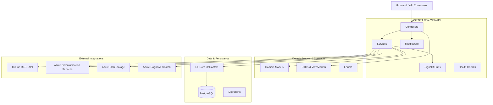

### Architecture Overview

Legend
- Controllers: HTTP endpoints mapping requests to services
- Services: Business logic and integration adapters
- DbContext: EF Core data access to PostgreSQL
- Models/DTOs/Enums: Domain entities and API contracts
- Middleware: Cross-cutting concerns
- Realtime: SignalR notifications
- External: GitHub and Azure services

 
