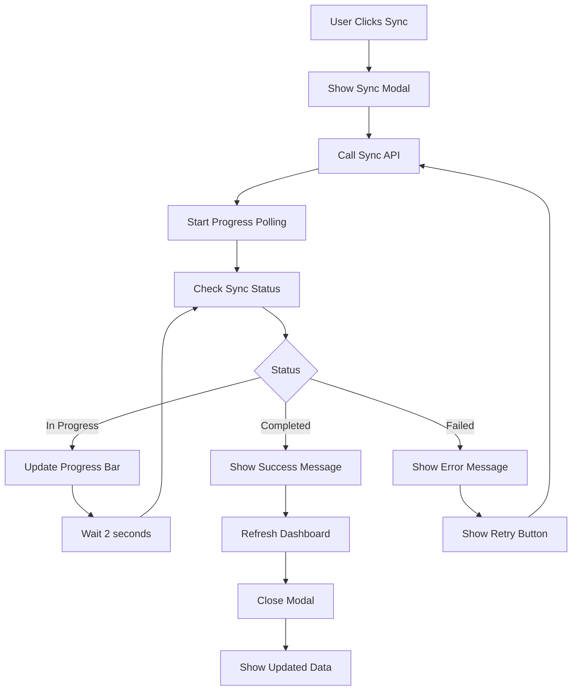

# Frontend Flow Diagrams

This document contains visual flow diagrams for GitHub integration frontend implementation.

## 1. Complete User Journey Flow

## 2. API Call Flow

## 3. Component State Flow

## 4. Data Loading Strategy

## 5. Error Handling Flow

## 6. Mobile Responsive Flow

## 7. Performance Optimization Flow

## 8. Sync Process Flow

## 9. Component Hierarchy

## 10. Data Flow Architecture

These diagrams provide a comprehensive visual guide for frontend developers to understand the complete flow of GitHub integration, from user interactions to API calls and state management.
